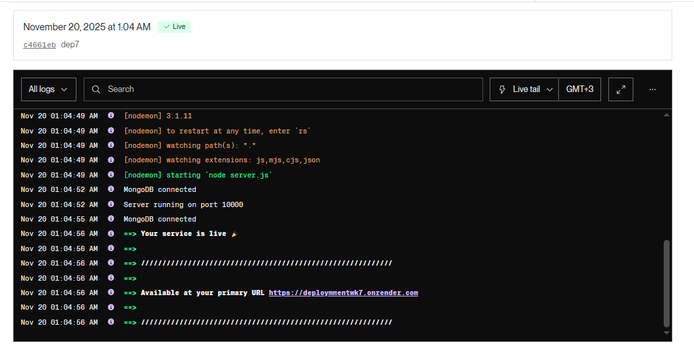
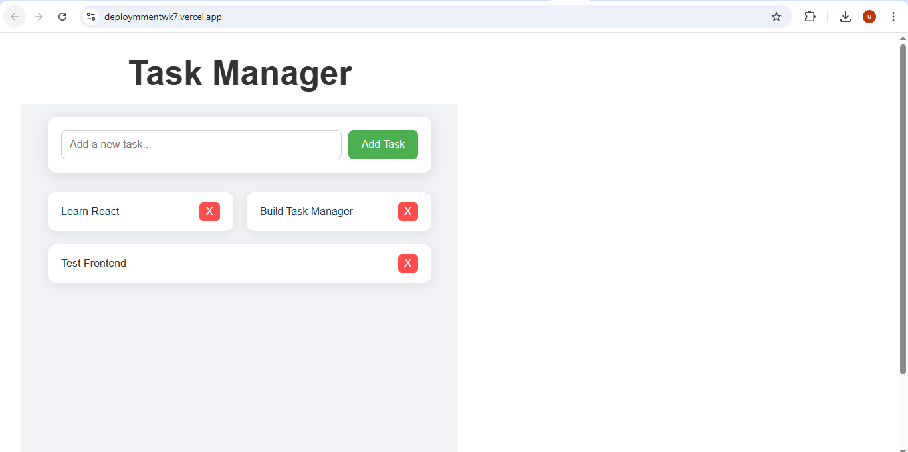

## Project  Structure

DEPLOYMENT-AND-DEVOPS-ESSENTIALS/
│
├── backend/                  # Express.js backend API
│   ├── src/
│   ├── package.json
│   ├── .env (not committed)
│   └── ...
│
├── frontend/                 # React (Vite) frontend
│   ├── src/
│   ├── package.json
│   ├── .env (not committed)
│   └── ...
│
├── screenshots/              # Screenshots for README.md
│   ├── screenshot1.PNG
│   ├── screenshot2.PNG
│   └── ...
│
├── .github/
│   └── workflows/            # CI/CD pipeline files (optional)
│       ├── frontend-ci.yml
│       ├── backend-ci.yml
│       ├── frontend-cd.yml
│       └── backend-cd.yml
│
├── .gitignore
├── README.md                 # Your documentation
└── Week7-Assignment.md       # Assignment instructions

🚀 Deployment Steps

1️⃣ Prepare Application for Production

Added optimized production builds for React using Vite

Configured environment variables using .env files

Enabled CORS on backend

Updated package.json scripts for deployment

2️⃣ Backend Deployment (Render)

Created a Render web service

Connected GitHub repository

Added environment variables

Installed build command

Configured auto-deploy on new push

3️⃣ Frontend Deployment (Vercel)

Connected React client folder to Vercel

Provided environment variables (API URL)

Built production-ready frontend

Enabled automatic redeployment via GitHub

4️⃣ CI/CD Setup (GitHub Actions)

Workflows included:

Workflow	Purpose
frontend-ci.yml	Run tests and build React app
backend-ci.yml	Run backend tests
frontend-cd.yml	Deploy frontend automatically
backend-cd.yml	Deploy backend automatically
5️⃣ Monitoring Setup

Configured uptime monitoring (e.g., UptimeRobot)

Added basic error logging

Console and API response monitoring enabled

🧪 Running the Project Locally

Clone Repository
git clone <your-repo-url>
cd <repo-name>

Install Dependencies

Frontend:

cd client
npm install

Backend:

cd server
npm install

Run Development Servers

Frontend:

npm run dev

Backend:

npm start

SCREENSHOTS

## 📸 Screenshots

### CI/CD Pipeline Running

### Deployment Success

DEPLOYMENT LINKS

VERCEL 

https://deploymmentwk7.vercel.app/

RENDER 

https://deploymmentwk7.onrender.com

